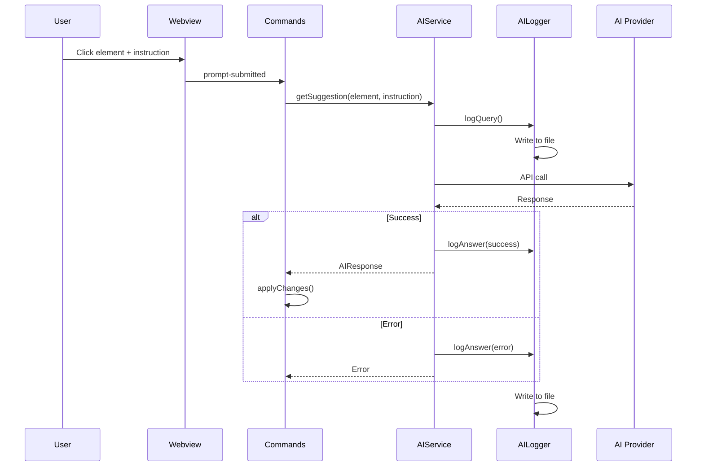

# AI Logging System Specification

## 1. Vue d'ensemble du système

Le système de logging AI permet d'enregistrer toutes les interactions avec les différents providers IA (Groq, OpenAI, Anthropic, Ollama, Mock). Il capture :
- Les **queries** (requêtes) envoyées à l'IA
- Les **answers** (réponses) reçues de l'IA

### Flux de données actuel

```
┌─────────────┐     prompt-submitted      ┌──────────────────┐
│   Webview   │ ─────────────────────────► │   commands/index │
└─────────────┘                            └────────┬─────────┘
                                                   │
                                          aiService.getSuggestion()
                                                   │
                                          ┌────────▼─────────┐
                                          │    AIService    │
                                          │  (aiService.ts)  │
                                          └────────┬─────────┘
                                                   │
                              ┌────────────────────┼────────────────────┐
                              ▼                    ▼                    ▼
                        ┌──────────┐         ┌──────────┐         ┌──────────┐
                        │   Groq   │         │  OpenAI  │         │Anthropic │
                        └──────────┘         └──────────┘         └──────────┘
                              │                    │                    │
                              └────────────────────┼────────────────────┘
                                                   │
                                          AIResponse
                                                   │
                                          handleApplyConfirmed()
                                                   │
                                          ┌────────▼─────────┐
                                          │  Fichiers HTML   │
                                          │      / CSS       │
                                          └──────────────────┘
```

### Points d'intégration du logging

| Point | Fichier | Fonction | Données à journaliser |
|-------|---------|----------|----------------------|
| 1 | [`commands/index.ts`](src/extension/commands/index.ts:294) | `handlePromptSubmitted()` | Instruction + ElementData |
| 2 | [`aiService.ts`](src/extension/ai/aiService.ts:16) | `getSuggestion()` | Prompt construit + Provider |

## 2. Structure des données de log

### 2.1 Query (requête)

```typescript
interface AILogQuery {
    id: string;                    // UUID unique
    timestamp: string;            // ISO 8601
    provider: AIProvider;          // 'openai' | 'anthropic' | 'groq' | 'ollama' | 'mock'
    instruction: string;           // Instruction utilisateur brute
    elementContext: {
        tagName: string;
        id: string;
        classList: string[];
        cssSelector: string;
        filePath?: string;
    };
    fullPrompt?: string;           // Prompt complet envoyé (si différent de l'instruction)
}
```

### 2.2 Answer (réponse)

```typescript
interface AILogAnswer {
    id: string;                    // UUID (référence à la query)
    timestamp: string;             // ISO 8601
    success: boolean;
    response?: {
        selector: string;
        changes: {
            css: string;
            html: string;
        };
    };
    error?: {
        type: string;
        message: string;
        retryable: boolean;
    };
    duration: number;              // Temps de réponse en millisecondes
}
```

### 2.3 Entrée de log complète

```typescript
interface AILogEntry {
    query: AILogQuery;
    answer: AILogAnswer;
}
```

## 3. Format du fichier de log

### 3.1 Emplacement

- **Répertoire** : `{workspace}/ai-logs/`
- **Fichier** : `ai-session-{date}.log` (un fichier par jour)
- **Chemin complet** : `{workspace}/ai-logs/ai-session-2026-03-19.log`

### 3.2 Format JSON Lines

Chaque entrée est une ligne JSON valide (JSON Lines format) :

```json
{"query":{"id":"550e8400-e29b-41d4-a716-446655440000","timestamp":"2026-03-19T14:30:00.000Z","provider":"groq","instruction":"center this element","elementContext":{"tagName":"div","id":"header","classList":["container"],"cssSelector":"#header"}},"answer":{"id":"550e8400-e29b-41d4-a716-446655440000","timestamp":"2026-03-19T14:30:01.500Z","success":true,"response":{"selector":"#header","changes":{"css":"display: flex; justify-content: center; align-items: center;","html":""}},"duration":1500}}
```

### 3.3 Formatage lisible (optionnel)

Pour le développement, un format lisible peut être activé :

```
================================================================================
[2026-03-19 14:30:00] QUERY #550e8400-e29b-41d4-a716-446655440000
================================================================================
Provider:  groq
Instruction: center this element
Element:    div#header.container (#header)
File:       /path/to/file.html

================================================================================
[2026-03-19 14:30:01] ANSWER #550e8400-e29b-41d4-a716-446655440000 (1500ms)
================================================================================
Status:     SUCCESS ✓
Selector:   #header
CSS:        display: flex; justify-content: center; align-items: center;
HTML:       (no changes)

================================================================================
```

## 4. Architecture des composants

### 4.1 Module AILogger

```
src/extension/ai/
├── aiService.ts          # Service IA existant
├── aiLogger.ts          # NOUVEAU - Service de logging
└── types/
    └── logger.ts         # NOUVEAU - Types pour le logger
```

### 4.2 Classe AILogger

```typescript
export class AILogger {
    private logDir: string;
    private logFile: string;
    private stream: WriteStream | null;

    constructor(workspacePath: string);
    
    initialize(): Promise<void>;
    
    logQuery(entry: AILogQuery): Promise<void>;
    
    logAnswer(entry: AILogAnswer): Promise<void>;
    
    logEntry(entry: AILogEntry): Promise<void>;
    
    getLogFilePath(): string;
    
    close(): Promise<void>;
}
```

## 5. Configuration

### 5.1 Options configurables

| Option | Type | Défaut | Description |
|--------|------|--------|-------------|
| `aiLogging.enabled` | boolean | `true` | Activer/désactiver le logging |
| `aiLogging.logDir` | string | `ai-logs/` | Répertoire des logs |
| `aiLogging.format` | `'json'` \| `'readable'` | `'json'` | Format des logs |
| `aiLogging.includeFullPrompt` | boolean | `true` | Inclure le prompt complet |

### 5.2 Configuration VSCode

Les options seront ajoutées à `package.json` dans la section `configuration`.

## 6. Cas d'utilisation

### 6.1 Débogage

- Tracer les requêtes qui échouent
- Analyser les temps de réponse par provider
- Comparer les réponses entre providers

### 6.2 Audit

- Garder un historique des modifications apportées
- Reproduire les actions effectuées
- Analyser les patterns d'utilisation

### 6.3 Amélioration

- Entraîner des modèles sur les interactions réelles
- Analyser les instructions les plus fréquentes
- Optimiser les prompts

## 7. Sécurité et vie privée

### 7.1 Données sensibles

- **NE PAS** logger les API keys
- **NE PAS** logger le contenu complet des fichiers utilisateur
- **NE PAS** logger les informations personnelles

### 7.2 Limites

- Limiter la taille des instructions loguées (max 1000 caractères)
- Limiter la taille des réponses CSS/HTML (max 5000 caractères)
- Rotation automatique des logs (fichier par jour)

## 8. Points d'intégration détaillés

### 8.1 Intégration dans AIService

```typescript
// Dans aiService.ts
async getSuggestion(elementData: ElementData, instruction: string): Promise<AIResponse | ErrorResponse> {
    const queryId = generateUUID();
    const startTime = Date.now();
    
    // Logger la query
    await this.logger?.logQuery({
        id: queryId,
        timestamp: new Date().toISOString(),
        provider: this.configService.getProvider(),
        instruction,
        elementContext: {
            tagName: elementData.tagName,
            id: elementData.id,
            classList: elementData.classList,
            cssSelector: elementData.cssSelector,
            filePath: elementData.filePath
        },
        fullPrompt: this.buildPrompt(elementData, instruction)
    });
    
    try {
        const response = await this.callProvider(prompt);
        
        // Logger la réponse
        await this.logger?.logAnswer({
            id: queryId,
            timestamp: new Date().toISOString(),
            success: true,
            response,
            duration: Date.now() - startTime
        });
        
        return response;
    } catch (error) {
        // Logger l'erreur
        await this.logger?.logAnswer({
            id: queryId,
            timestamp: new Date().toISOString(),
            success: false,
            error: {
                type: 'network-error',
                message: error.message,
                retryable: true
            },
            duration: Date.now() - startTime
        });
        
        throw error;
    }
}
```

### 8.2 Initialisation

```typescript
// Dans main.ts
export function activate(context: vscode.ExtensionContext): void {
    // ... code existant ...
    
    const logger = new AILogger(context.extensionUri.fsPath);
    await logger.initialize();
    
    const aiService = new AIService(configService, logger);
}
```

## 9. Diagramme de séquence



## 10. Implémentation recommandée

### Ordre de développement

1. Créer les types dans `src/shared/types.ts` (augmenter les types existants)
2. Créer le service `AILogger` dans `src/extension/ai/aiLogger.ts`
3. Modifier `AIService` pour accepter le logger en paramètre
4. Ajouter les appels de logging dans `AIService.getSuggestion()`
5. Ajouter la configuration dans `package.json`
6. Ajouter les commandes pour accéder aux logs

### Fichiers à modifier

- `src/shared/types.ts` - Ajouter types AILogQuery, AILogAnswer, AILogEntry
- `src/extension/ai/aiLogger.ts` - NOUVEAU fichier
- `src/extension/ai/aiService.ts` - Modifier constructor et getSuggestion()
- `src/extension/main.ts` - Initialiser AILogger
- `package.json` - Ajouter configuration
