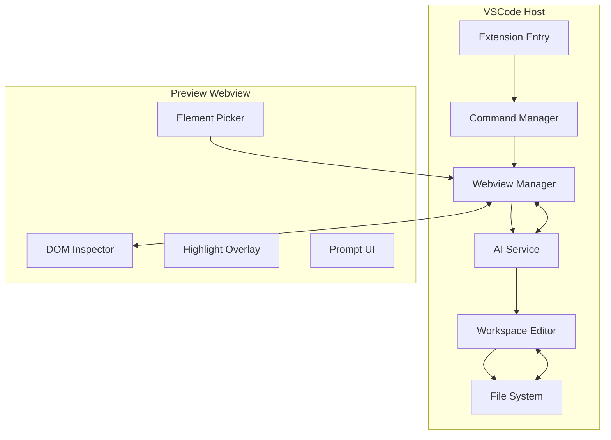
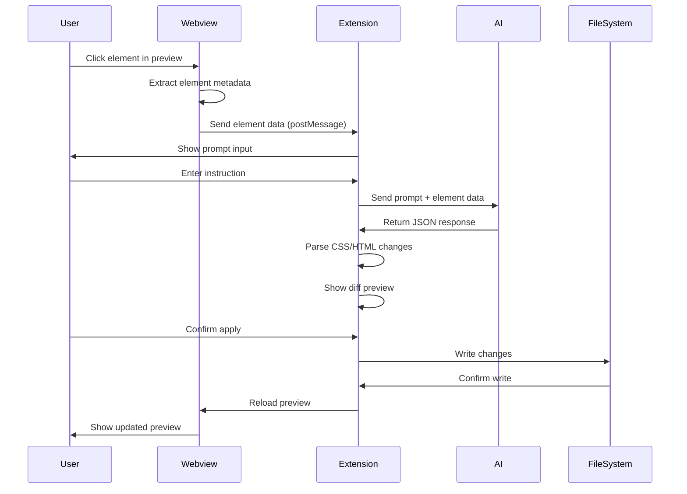
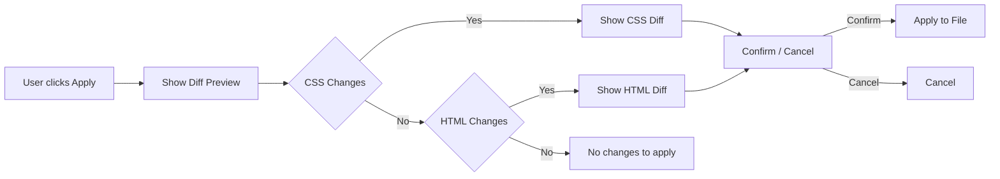

# AI Visual HTML Editor - Architecture Document

## 1. PROJECT OVERVIEW

**Project Name:** AI Visual HTML Editor (VSCode Extension)  
**Goal:** Allow developers to visually edit HTML/CSS using AI directly from a live preview  
**Target Users:** Web developers working with plain HTML/CSS projects

---

## 2. ARCHITECTURE

### 2.1 Module Structure



### 2.2 Main Modules

| Module | Responsibility | Key Functions |
|--------|----------------|---------------|
| `Extension Entry` | Initialize extension, register commands | `activate()`, `deactivate()` |
| `Command Manager` | Handle VSCode commands | `startPreview`, `stopPreview`, `undo` |
| `Webview Manager` | Create/manage preview webview | `createWebview()`, `postMessage()`, `onMessage()` |
| `AI Service` | Send prompts to AI, parse responses | `sendPrompt()`, `parseResponse()` |
| `Workspace Editor` | Apply code changes safely | `applyCSS()`, `applyHTML()`, `createUndo()` |
| `DOM Inspector` | Extract element metadata | `getElementInfo()`, `highlightElement()` |
| `Element Picker` | Handle hover/click events | `enablePicker()`, `onElementClick()` |
| `Prompt UI` | User input interface | `showPrompt()`, `hidePrompt()` |

### 2.3 Module Responsibilities

```
src/
├── extension/
│   ├── main.ts              # Entry point, activation
│   ├── commands/            # VSCode command handlers
│   ├── webview/             # Webview management
│   ├── ai/                  # AI integration
│   ├── editor/              # Code modification
│   └── utils/               # Helpers, logging
├── webview/
│   ├── preview.ts           # Main preview script
│   ├── inspector.ts         # DOM inspection
│   ├── picker.ts            # Element picker
│   ├── ui/                  # Prompt UI components
│   └── styles/              # CSS for webview
└── shared/
    ├── types.ts             # TypeScript interfaces
    └── constants.ts         # Shared constants
```

---

## 3. DATA FLOW

### 3.1 Click Event Flow



### 3.2 Message Types

```typescript
// Webview → Extension
type WebviewMessage = 
    | { type: 'element-clicked', payload: ElementData }
    | { type: 'element-hovered', payload: ElementData }
    | { type: 'prompt-submitted', payload: { instruction: string, element: ElementData } }
    | { type: 'apply-confirmed', payload: ChangeSet };

// Extension → Webview
type ExtensionMessage = 
    | { type: 'show-prompt', payload: ElementData }
    | { type: 'hide-prompt' }
    | { type: 'highlight-element', payload: ElementData }
    | { type: 'clear-highlight' }
    | { type: 'reload-preview' }
    | { type: 'show-diff', payload: ChangeSet };
```

### 3.3 Element Data Structure

```typescript
interface ElementData {
    tagName: string;
    id: string;
    classList: string[];
    outerHTML: string;
    innerHTML: string;
    xpath: string;
    cssSelector: string;
    attributes: Record<string, string>;
    styles: Record<string, string>;
    filePath?: string;
    lineNumber?: number;
}
```

---

## 4. MVP PLAN

### Step 1: Basic Extension Shell
- [ ] Initialize VSCode extension project
- [ ] Set up package.json with proper configuration
- [ ] Create basic extension entry point
- [ ] Register start/stop commands
- [ ] Add logging system

### Step 2: Webview Preview
- [ ] Create webview with HTML preview capability
- [ ] Load current HTML file into webview
- [ ] Set up PostMessage communication
- [ ] Handle local file resource loading
- [ ] Implement refresh functionality

### Step 3: Element Click Detection
- [ ] Inject DOM inspector script into webview
- [ ] Implement element picker (hover highlight)
- [ ] Extract element metadata on click
- [ ] Send element data to extension
- [ ] Add visual highlight overlay

### Step 4: Prompt Input UI
- [ ] Create prompt input panel in webview
- [ ] Position prompt near clicked element
- [ ] Handle user input submission
- [ ] Send instruction to extension

### Step 5: Mock AI Response
- [ ] Set up AI service with mock responses
- [ ] Define prompt format
- [ ] Parse mock JSON responses
- [ ] Test with sample instructions

### Step 6: Apply CSS Changes
- [ ] Parse AI CSS response
- [ ] Create CSS rule or modify existing
- [ ] Use WorkspaceEdit API for safe apply
- [ ] Show diff before applying

### Step 7: Preview Refresh
- [ ] Reload webview after changes
- [ ] Maintain element picker state
- [ ] Add undo support
- [ ] Handle errors gracefully

---

## 5. FILE STRUCTURE

```
ai-visual-html-editor/
├── package.json
├── tsconfig.json
├── vsc-extension-quickstart.md
├── README.md
├── .vscode/
│   ├── tasks.json
│   ├── launch.json
│   └── extensions.json
├── src/
│   ├── extension/
│   │   ├── main.ts                 # Extension entry point
│   │   ├── commands/
│   │   │   ├── startPreview.ts     # Start preview command
│   │   │   ├── stopPreview.ts      # Stop preview command
│   │   │   └── undo.ts             # Undo last change
│   │   ├── webview/
│   │   │   ├── webviewManager.ts   # Webview lifecycle
│   │   │   └── webviewScript.ts    # Script injected to webview
│   │   ├── ai/
│   │   │   ├── aiService.ts        # AI integration
│   │   │   └── promptBuilder.ts    # Build AI prompts
│   │   ├── editor/
│   │   │   ├── cssApplier.ts       # Apply CSS changes
│   │   │   ├── htmlApplier.ts      # Apply HTML changes
│   │   │   └── diffPreview.ts      # Show diff before apply
│   │   └── utils/
│   │       ├── logger.ts           # Logging utility
│   │       └── fileUtils.ts        # File operations
│   ├── webview/
│   │   ├── preview.html            # Webview HTML template
│   │   ├── preview.ts              # Webview main script
│   │   ├── inspector.ts            # DOM inspection
│   │   ├── picker.ts               # Element picker
│   │   ├── promptUI.ts             # Prompt input UI
│   │   └── styles/
│   │       ├── picker.css          # Picker styles
│   │       └── prompt.css          # Prompt UI styles
│   └── shared/
│       ├── types.ts                # TypeScript interfaces
│       └── constants.ts            # Constants
└── plans/
    └── architecture.md             # This document
```

---

## 6. CODE SNIPPETS

### 6.1 Extension Activation

```typescript
// src/extension/main.ts
import * as vscode from 'vscode';
import { WebviewManager } from './webview/webviewManager';
import { registerCommands } from './commands';

let webviewManager: WebviewManager | undefined;

export function activate(context: vscode.ExtensionContext) {
    console.log('[AI Visual Editor] Extension activating...');
    
    // Initialize webview manager
    webviewManager = new WebviewManager(context);
    
    // Register commands
    registerCommands(context, webviewManager);
    
    console.log('[AI Visual Editor] Extension activated');
}

export function deactivate() {
    console.log('[AI Visual Editor] Extension deactivated');
    webviewManager?.dispose();
}
```

### 6.2 Webview Creation

```typescript
// src/extension/webview/webviewManager.ts
import * as vscode from 'vscode';

export class WebviewManager {
    private panel: vscode.WebviewPanel | undefined;
    private context: vscode.ExtensionContext;
    
    constructor(context: vscode.ExtensionContext) {
        this.context = context;
    }
    
    public createPreview(htmlPath: string): vscode.WebviewPanel {
        this.panel = vscode.window.createWebviewPanel(
            'aiVisualEditor',
            'AI Visual HTML Editor',
            vscode.ViewColumn.Two,
            {
                enableScripts: true,
                retainContextWhenHidden: true,
                localResourceRoots: [
                    vscode.Uri.file(require('path').dirname(htmlPath))
                ]
            }
        );
        
        // Load HTML content
        const htmlContent = require('fs').readFileSync(htmlPath, 'utf-8');
        this.panel.webview.html = this.injectScript(htmlContent);
        
        // Handle messages from webview
        this.panel.webview.onDidReceiveMessage(async (message) => {
            await this.handleMessage(message);
        });
        
        return this.panel;
    }
    
    public postMessage(message: any): void {
        this.panel?.webview.postMessage(message);
    }
    
    private async handleMessage(message: any): Promise<void> {
        switch (message.type) {
            case 'element-clicked':
                // Show prompt UI
                this.postMessage({ type: 'show-prompt', payload: message.payload });
                break;
            // Handle other message types...
        }
    }
    
    public dispose(): void {
        this.panel?.dispose();
    }
}
```

### 6.3 Message Passing

```typescript
// Webview side - sending messages
const vscode = acquireVsCodeApi();

function sendElementClick(elementData: ElementData): void {
    vscode.postMessage({
        type: 'element-clicked',
        payload: elementData
    });
}

// Extension side - receiving messages
this.panel.webview.onDidReceiveMessage(async (message) => {
    if (message.type === 'element-clicked') {
        const elementData = message.payload;
        // Process element data...
    }
});
```

### 6.4 Click Detection Script

```typescript
// src/webview/inspector.ts
interface ElementData {
    tagName: string;
    id: string;
    classList: string[];
    outerHTML: string;
    xpath: string;
    cssSelector: string;
    attributes: Record<string, string>;
    styles: Record<string, string>;
}

function getElementInfo(target: HTMLElement): ElementData {
    return {
        tagName: target.tagName.toLowerCase(),
        id: target.id,
        classList: Array.from(target.classList),
        outerHTML: target.outerHTML,
        xpath: getXPath(target),
        cssSelector: getCSSSelector(target),
        attributes: getAttributes(target),
        styles: getComputedStyles(target)
    };
}

function getXPath(element: HTMLElement): string {
    // Generate unique XPath for element
    // Implementation details...
}

function getCSSSelector(element: HTMLElement): string {
    // Generate CSS selector for element
    // Implementation details...
}

// Event listeners
document.addEventListener('click', (event) => {
    const target = event.target as HTMLElement;
    const elementData = getElementInfo(target);
    sendElementClick(elementData);
});
```

### 6.5 Applying Edits

```typescript
// src/extension/editor/cssApplier.ts
import * as vscode from 'vscode';

export async function applyCSSChanges(
    filePath: string,
    selector: string,
    cssChanges: string
): Promise<boolean> {
    const document = await vscode.workspace.openTextDocument(filePath);
    const edit = new vscode.WorkspaceEdit();
    
    // Parse CSS and create/edit rule
    // This is a simplified version - full implementation 
    // would use AST parsing
    
    const fullText = document.getText();
    const newText = injectCSSRule(fullText, selector, cssChanges);
    
    const fullRange = new vscode.Range(
        document.positionAt(0),
        document.positionAt(fullText.length)
    );
    
    edit.replace(document.uri, fullRange, newText);
    
    const success = await vscode.workspace.applyEdit(edit);
    
    if (success) {
        await document.save();
    }
    
    return success;
}

function injectCSSRule(documentText: string, selector: string, css: string): string {
    // Find or create style block, inject rule
    // Implementation details...
}
```

---

## 7. AI INTEGRATION

### 7.1 Prompt Format

```typescript
const buildAIprompt = (elementData: ElementData, instruction: string): string => {
    return `
You are a web developer assistant. Modify the following HTML element based on the user's instruction.

Element Information:
- Tag: ${elementData.tagName}
- ID: ${elementData.id || 'none'}
- Classes: ${elementData.classList.join(' ') || 'none'}
- Current CSS: ${JSON.stringify(elementData.styles)}
- Outer HTML: ${elementData.outerHTML}

Instruction: "${instruction}"

Respond with ONLY a JSON object in this exact format:
{
    "selector": "css selector to target this element",
    "changes": {
        "css": "CSS properties to add or modify (prefer this over HTML changes)",
        "html": "HTML changes if absolutely necessary (otherwise empty string)"
    }
}

Do NOT include any text outside the JSON object.
`;
};
```

### 7.2 Expected Response Format

```typescript
interface AIResponse {
    selector: string;
    changes: {
        css: string;
        html: string;
    };
}

// Example response:
{
    "selector": "#my-image",
    "changes": {
        "css": "display: block; margin: 0 auto; width: 50%;",
        "html": ""
    }
}
```

### 7.3 Error Handling

```typescript
interface AIError {
    type: 'parse-error' | 'network-error' | 'invalid-response';
    message: string;
    retryable: boolean;
}

async function callAI(prompt: string): Promise<AIResponse | AIError> {
    try {
        // Call AI API (OpenAI, Anthropic, etc.)
        const response = await fetch('https://api.example.com/v1/completions', {
            method: 'POST',
            headers: { 'Content-Type': 'application/json' },
            body: JSON.stringify({ prompt, max_tokens: 500 })
        });
        
        const data = await response.json();
        const parsed = JSON.parse(data.choices[0].text);
        
        // Validate response structure
        if (!parsed.selector || !parsed.changes) {
            return { type: 'invalid-response', message: 'Invalid response format', retryable: true };
        }
        
        return parsed;
    } catch (error) {
        return { 
            type: 'parse-error', 
            message: error.message, 
            retryable: true 
        };
    }
}
```

---

## 8. UX DETAILS

### 8.1 Selection Highlight

```css
/* Highlight overlay styles */
.ai-highlight-overlay {
    position: absolute;
    border: 2px solid #007acc;
    background-color: rgba(0, 122, 204, 0.1);
    pointer-events: none;
    z-index: 99999;
    transition: all 0.1s ease;
}

.ai-highlight-overlay:hover {
    border-color: #ffcc00;
    background-color: rgba(255, 204, 0, 0.2);
}
```

### 8.2 Prompt UI

The prompt appears as a floating panel near the clicked element:

```
┌─────────────────────────────────────────┐
│  🎯 Selected:     │
│  ┌─────────────────────────────────────┐│
│  │ What do you want to change?        ││
│  │ [Enter instruction...          ]   ││
│  └─────────────────────────────────────┘│
│  [Cancel]              [Apply Changes] │
└─────────────────────────────────────────┘
```

Features:
- Auto-position near clicked element (within viewport bounds)
- Show element preview (tag, id, classes)
- Input field with placeholder examples
- Cancel and Apply buttons
- Keyboard support (Enter to submit, Esc to cancel)

### 8.3 Diff Preview

Before applying changes, show a diff view:



Diff display:
- Green: Added CSS properties
- Red: Removed CSS properties
- Line numbers where changes will be applied
- Option to edit manually before applying

---

## 9. FUTURE IMPROVEMENTS

### Multi-file Support
- [ ] Detect and edit related CSS files
- [ ] Handle @import statements
- [ ] Support external stylesheets
- [ ] Multiple HTML file support

### Framework Support
- [ ] Tailwind CSS detection and editing
- [ ] React JSX support with component mapping
- [ ] Vue single-file component support
- [ ] Angular template support

### Visual Editing
- [ ] Drag and drop elements
- [ ] Resize handles
- [ ] Color picker
- [ ] Spacing guides

### Advanced AI
- [ ] Context-aware suggestions
- [ ] Code explanation
- [ ] Accessibility recommendations
- [ ] Responsive design suggestions

### Collaboration
- [ ] Share presets
- [ ] History sync
- [ ] Team style guides
- [ ] Version control integration

---

## 10. SUMMARY

This architecture provides:

1. **Clean separation of concerns** - Webview, Extension, and AI service are decoupled
2. **Type-safe communication** - Message types are well-defined
3. **Safe code modification** - Uses WorkspaceEdit API with diff preview
4. **Extensible design** - Easy to add new features
5. **User-friendly UX** - Visual highlighting, intuitive prompts

The MVP follows a 7-step plan focusing on core functionality first, then adding features incrementally.
