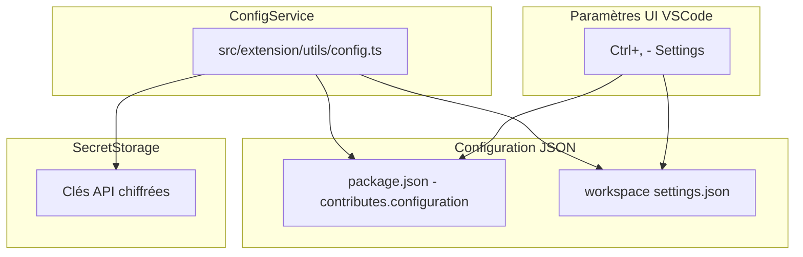

# Plan de Configuration - AI Visual HTML Editor

## 1. Problème Identifié

### 1.1 Commande "Show Current Config"

**Problème actuel:**
- La commande [`aiVisualEditor.showConfig`](src/extension/commands/configCommands.ts:196) affiche une notification VSCode avec les informations de configuration
- **Comportement souhaité:** Ouvrir le fichier JSON des paramètres VSCode (`settings.json`)

**Solution proposée:**
```typescript
// Nouvelle implémentation de showConfig
context.subscriptions.push(
    vscode.commands.registerCommand(
        'aiVisualEditor.showConfig',
        async () => {
            // Ouvrir les paramètres JSON de VSCode
            await vscode.commands.executeCommand('workbench.action.openSettingsJson');
        }
    )
);
```

---

## 2. Structure de Configuration

### 2.1 Architecture Globale



### 2.2 Types de Configuration

| Type | Stockage | Accès | Sécurité |
|------|----------|-------|----------|
| Paramètres non-sensibles | `settings.json` | `vscode.workspace.getConfiguration()` | Normale |
| Clés API | `SecretStorage` | `context.secrets` | Chiffrée |

---

## 3. Paramètres VSCode (settings.json)

### 3.1 Paramètres définis dans package.json

```json
{
  "aiVisualEditor.aiProvider": {
    "type": "string",
    "enum": ["mock", "groq", "ollama", "openai", "anthropic"],
    "default": "mock",
    "description": "AI provider to use for generating changes"
  },
  "aiVisualEditor.groqModel": {
    "type": "string",
    "default": "llama-3.3-70b-versatile",
    "description": "Groq model to use"
  },
  "aiVisualEditor.ollamaModel": {
    "type": "string",
    "default": "llama3.2",
    "description": "Ollama model to use"
  },
  "aiVisualEditor.ollamaUrl": {
    "type": "string",
    "default": "http://localhost:11434",
    "description": "Ollama server URL"
  },
  "aiVisualEditor.previewPort": {
    "type": "number",
    "default": 3000,
    "description": "Port for local preview server"
  }
}
```

### 3.2 Emplacement des paramètres

```
Paramètres utilisateur:   %APPDATA%\Code\User\settings.json
Paramètres workspace:    {workspace}/.vscode/settings.json
```

### 3.3 Comment modifier les paramètres

**Via l'UI:**
1. `Ctrl+,` (Windows/Linux) ou `Cmd+,` (Mac)
2. Rechercher "aiVisualEditor"
3. Modifier les valeurs

**Via JSON:**
1. `Ctrl+Shift+P` → "Open Settings (JSON)"
2. Ajouter/modifier les valeurs

**Via commandes de l'extension:**
- [`aiVisualEditor.setOllamaUrl`](src/extension/commands/configCommands.ts:171) - Configure l'URL Ollama

---

## 4. Configuration des API AI

### 4.1 Providers Supportés

| Provider | Type | Clé API requise | Modèle par défaut |
|----------|------|-----------------|-------------------|
| `mock` | Local | Non | - |
| `groq` | Cloud | Oui | `llama-3.3-70b-versatile` |
| `openai` | Cloud | Oui | `gpt-4o-mini` |
| `anthropic` | Cloud | Oui | `claude-3-haiku-20240307` |
| `ollama` | Local | Non | `llama3.2` |

### 4.2 Stockage des Clés API

Les clés API sont stockées de manière sécurisée via **VSCode SecretStorage**:

```
Clé stockée: aiVisualEditor.apiKey.{provider}
```

**Emplacement:** `%APPDATA%\Code\User\globalStorage\ai-visual-editor\secretStorage.json`

### 4.3 Configuration par Provider

#### Groq (Recommandé - Gratuit et rapide)

```bash
# 1. Obtenir une clé API gratuite sur https://console.groq.com/keys
# 2. Exécuter la commande:
vscode.commands.executeCommand('aiVisualEditor.setGroqApiKey')
# 3. Entrer la clé API
# 4. Le provider est automatiquement configuré
```

**Paramètres:**
- Clé: `aiVisualEditor.apiKey.groq` (SecretStorage)
- Modèle: `aiVisualEditor.groqModel` (défaut: `llama-3.3-70b-versatile`)

#### OpenAI

```bash
# 1. Obtenir une clé API sur https://platform.openai.com/api-keys
# 2. Exécuter la commande:
vscode.commands.executeCommand('aiVisualEditor.setOpenAiApiKey')
# 3. Entrer la clé API
# 4. Le provider est automatiquement configuré
```

**Paramètres:**
- Clé: `aiVisualEditor.apiKey.openai` (SecretStorage)
- Modèle: Utilise GPT-4o-mini par défaut

#### Anthropic (Claude)

```bash
# 1. Obtenir une clé API sur https://console.anthropic.com/
# 2. Exécuter la commande:
vscode.commands.executeCommand('aiVisualEditor.setAnthropicApiKey')
# 3. Entrer la clé API
# 4. Le provider est automatiquement configuré
```

**Paramètres:**
- Clé: `aiVisualEditor.apiKey.anthropic` (SecretStorage)

#### Ollama (Local - Gratuit)

```bash
# 1. Installer Ollama depuis https://ollama.com/
# 2. Lancer un modèle: ollama serve && ollama pull llama3.2
# 3. Exécuter la commande:
vscode.commands.executeCommand('aiVisualEditor.setOllamaUrl')
# 4. Entrer l'URL (défaut: http://localhost:11434)
```

**Paramètres:**
- URL: `aiVisualEditor.ollamaUrl` (défaut: `http://localhost:11434`)
- Modèle: `aiVisualEditor.ollamaModel` (défaut: `llama3.2`)

---

## 5. Structure des Fichiers de Configuration

### 5.1 Fichiers clés

```
src/extension/
├── utils/
│   └── config.ts          # ConfigService - Gestion centraleisée
├── commands/
│   └── configCommands.ts  # Commandes de configuration
└── main.ts                # Initialisation du ConfigService
```

### 5.2 ConfigService (src/extension/utils/config.ts)

```typescript
class ConfigService {
    // Clés API (SecretStorage)
    - setApiKey(provider, apiKey)
    - getApiKey(provider)
    - deleteApiKey(provider)
    
    // Paramètres VSCode
    - getProvider() / setProvider()
    - getGroqModel()
    - getOllamaModel() / setOllamaUrl()
    - getPreviewPort()
}
```

---

## 6. Commandes de Configuration

| Commande | Description | Interface |
|----------|-------------|-----------|
| [`aiVisualEditor.setGroqApiKey`](src/extension/commands/configCommands.ts:74) | Configure Groq | InputBox |
| [`aiVisualEditor.setOpenAiApiKey`](src/extension/commands/configCommands.ts:106) | Configure OpenAI | InputBox |
| [`aiVisualEditor.setAnthropicApiKey`](src/extension/commands/configCommands.ts:138) | Configure Anthropic | InputBox |
| [`aiVisualEditor.setOllamaUrl`](src/extension/commands/configCommands.ts:170) | Configure Ollama | InputBox |
| [`aiVisualEditor.showConfig`](src/extension/commands/configCommands.ts:196) | **Affiche config** | ~~Notification~~ → **Settings JSON** |
| [`aiVisualEditor.resetConfig`](src/extension/commands/configCommands.ts:222) | Reset toute la config | Confirmation |

---

## 7. Implémentation de la Correction

### 7.1 Modification de showConfig

**Fichier:** [`src/extension/commands/configCommands.ts`](src/extension/commands/configCommands.ts:196)

**Avant (actuel):**
```typescript
vscode.commands.registerCommand(
    'aiVisualEditor.showConfig',
    async () => {
        // Affiche une notification avec les infos
        vscode.window.showInformationMessage(message);
    }
)
```

**Après (implémenté):**
```typescript
vscode.commands.registerCommand(
    'aiVisualEditor.showConfig',
    async () => {
        const workspaceFolder = vscode.workspace.workspaceFolders?.[0];
        if (!workspaceFolder) {
            vscode.window.showErrorMessage('No workspace folder open');
            return;
        }

        const configPath = vscode.Uri.joinPath(workspaceFolder.uri, 'ai-config.json');
        
        try {
            await vscode.workspace.fs.readFile(configPath);
        } catch {
            // Create default config if doesn't exist
            const defaultConfig = {
                aiProvider: configService.getProvider(),
                groq: {
                    model: configService.getGroqModel(),
                    apiKey: "(stored in VSCode secrets)"
                },
                openai: { apiKey: "(stored in VSCode secrets)" },
                anthropic: { apiKey: "(stored in VSCode secrets)" },
                ollama: {
                    url: configService.getOllamaUrl(),
                    model: configService.getOllamaModel()
                },
                previewPort: configService.getPreviewPort()
            };
            
            await vscode.workspace.fs.writeFile(
                configPath,
                Buffer.from(JSON.stringify(defaultConfig, null, 2))
            );
        }

        const doc = await vscode.workspace.openTextDocument(configPath);
        await vscode.window.showTextDocument(doc);
    }
)
```

**Résultat:** Crée/ouvre `ai-config.json` dans le workspace

### 7.2 Alternative - Ouvrir les paramètres UI

Si on préfère ouvrir l'UI des paramètres au lieu du JSON:
```typescript
await vscode.commands.executeCommand('workbench.action.openSettings');
```

---

## 8. Flux de Configuration Utilisateur

### 8.1 Première utilisation

```
1. L'utilisateur installe l'extension
2. Il appuie sur Ctrl+Alt+E (start preview)
3. Si provider != mock et pas de clé API:
   - Message d'erreur avec suggestion
4. L'utilisateur exécute la commande de configuration
5. Il saisit sa clé (masquée)
6. La clé est validée et chiffrée
7. Le provider est automatiquement défini
```

### 8.2 Vérification de la configuration

```
1. Ctrl+Shift+P → "AI Visual Editor: Show Configuration"
2. OU Ctrl+, → Rechercher "aiVisualEditor"
```

---

## 9. Résumé des Actions à Réaliser

### 9.1 Correction showConfig

| Fichier | Action |
|---------|--------|
| `src/extension/commands/configCommands.ts` | Modifier la commande `showConfig` pour ouvrir `settings.json` |

### 9.2 Documentation

| Fichier | Action |
|---------|--------|
| `plans/configuration-plan.md` | Créer ce document |

---

## 10. Exemple de Configuration Complete

### settings.json utilisateur

```json
{
  "aiVisualEditor.aiProvider": "groq",
  "aiVisualEditor.groqModel": "llama-3.3-70b-versatile",
  "aiVisualEditor.ollamaUrl": "http://localhost:11434",
  "aiVisualEditor.ollamaModel": "llama3.2",
  "aiVisualEditor.previewPort": 3000
}
```

### Commandes pour tout configurer

```typescript
// Via code
await configService.setProvider('groq');
await configService.setApiKey('groq', 'gsk_xxxxx');
await configService.setGroqModel('llama-3.3-70b-versatile');
```
